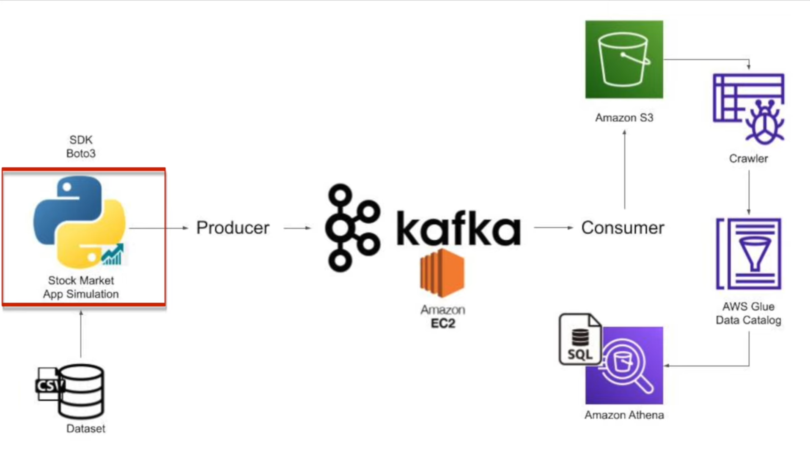

# 📈 Real-Time Stock Data Pipeline using Kafka and AWS

This project simulates a real-time stock market data pipeline using **Apache Kafka**, **AWS S3**, **AWS Glue**, and **Amazon Athena**. Stock data is streamed from a CSV file, processed using Kafka, and then sent to S3 for querying with SQL.

---

## 🚀 Architecture



---

## 🧩 Components Overview

| Component         | Description                                                                 |
|------------------|-----------------------------------------------------------------------------|
| 🐍 Python App     | Simulates real-time stock data using a CSV file                            |
| 🧪 Kafka Producer | Sends simulated data to Kafka topics                                       |
| ⚙️ Kafka Broker   | Hosted on Amazon EC2                                                       |
| 🧲 Kafka Consumer | Reads data from Kafka and writes to Amazon S3                             |
| 🪣 Amazon S3      | Stores raw stock data in object format                                     |
| 🕷️ AWS Glue       | Crawls S3 bucket and updates the Glue Data Catalog                         |
| 🔍 Amazon Athena  | Allows SQL queries over structured S3 data through Glue Data Catalog       |

---

## 🛠️ Technologies Used

- Python 3.x
- Apache Kafka (`kafka-python`)
- Amazon EC2 (Kafka Broker hosting)
- Amazon S3 (Storage)
- AWS Glue (Data Catalog & Crawler)
- Amazon Athena (SQL over S3)
- Boto3 (for optional S3 automation)

---

## 📁 Project Structure

```
real-time-stock-data-pipeline/
│
├── README.md
├── LICENSE
├── .gitignore
│
├── architecture.png           # Project diagram
│
├── data/
│   └── stocks.csv             # Sample dataset
│
├── producer/
│   ├── producer.ipynb         # Notebook version
│   ├── requirements.txt
│
├── consumer/
│   ├── consumer.ipynb
│   ├── requirements.txt
│
├── aws/
│   ├── s3_bucket_setup.md
│   ├── glue_crawler_config.md
│   ├── athena_queries.sql
│   └── boto3_s3_upload.py     # Optional boto3 upload
```

---

## 🔧 Setup Instructions

### 📦 1. Clone the Repository
```bash
git clone https://github.com/yourusername/real-time-stock-data-pipeline.git
cd real-time-stock-data-pipeline
```

### 🐍 2. Install Python Dependencies
Navigate to `producer/` and `consumer/` folders individually:
```bash
pip install -r requirements.txt
```

> If you're using Jupyter Notebook, install using notebook interface or VSCode kernel.

---

### 📤 3. Kafka Setup on EC2
- Launch EC2 instance (Ubuntu preferred)
- Install Java & Kafka
- Start Kafka and Zookeeper
- Open necessary ports in security group (9092, 2181)
- Update your Kafka producer & consumer bootstrap server to EC2 IP

---

### ▶️ 4. Run the Pipeline

#### Run Producer
```bash
cd producer
jupyter notebook
# Open producer.ipynb and run all cells
```

#### Run Consumer
```bash
cd consumer
jupyter notebook
# Open consumer.ipynb and run all cells
```

This will start sending data from the CSV to Kafka → and saving to S3.

---

### 🧰 5. Configure AWS Services

#### 🪣 S3
- Create a new bucket (e.g., `stock-data-bucket`)
- Ensure correct region and permissions (write access from consumer)

#### 🕷️ Glue
- Create a Crawler to scan your S3 folder
- Output to Glue Data Catalog
- Run the Crawler after some data is pushed

#### 🔍 Athena
- Open Athena console
- Select database created by Glue
- Start querying data using:
```sql
SELECT * FROM stock_data LIMIT 10;
```

---

## 📝 Sample Athena Query
```sql
SELECT symbol, AVG(price) as avg_price
FROM stock_data
WHERE event_time > current_date - interval '7' day
GROUP BY symbol
ORDER BY avg_price DESC;
```

---

## 📚 Useful References
- [AWS Glue Docs](https://docs.aws.amazon.com/glue/)
- [Amazon Athena Docs](https://docs.aws.amazon.com/athena/)
- [Kafka Python Client](https://kafka-python.readthedocs.io/en/master/)

---

## 👨‍💻 Author
**Mohammad Mufeez**  
BSc CS Student @ FAST NUCES | Data Engineering Enthusiast  
[GitHub Profile](https://github.com/yourusername)

---

## 📄 License
This project is licensed under the MIT License - see the [LICENSE](LICENSE) file for details.
